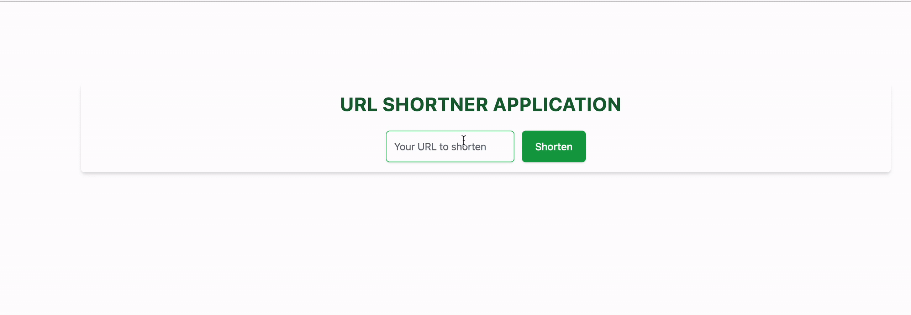

# Shorty - URL Shortener Application

URL shortening application using the Django framework and Tailwind CSS.

URL Shortener is a tool to shorten a URL.

## Tech Stack

**Client:** TailwindCSS

**Server:** Django

## Demo

## Contributing

Pull requests are welcome. For major changes, please open an issue first to discuss what you would like to change.

## License

[MIT](https://choosealicense.com/licenses/mit/)

